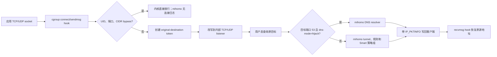

# Smart + eBPF 合并与维护开发手册

本文记录 `mingxitang/mihomo_epbf_smart` 的合并思路、初始移植方法、后续上游同步、编译发布流程，以及实际运行中遇到的 eBPF/DNS 问题。目标是让后续维护可以复现、验证和定位问题，而不是依赖本次对话记录。

## 1. 项目目标与上游关系

本仓库组合两个上游的特性：

- Smart 主线：`vernesong/mihomo` 的 `Alpha` 分支，提供 Smart 策略组；
- eBPF 特性源：`TanakaLun/mihomo` 的 `ebpf-inbound` 分支，提供 Linux/Android cgroup eBPF 入站和可选的热点 TC 数据路径；
- 组合仓库：`mingxitang/mihomo_epbf_smart`，维护分支为 `Alpha`。

这里的“合并两个内核”实际是**源码级特性移植**，不是合并两个已编译二进制。维护策略如下：

1. 始终把 Smart `Alpha` 当作产品主线；
2. 把 eBPF 当作需要持续携带的功能补丁集；
3. 初次移植使用 eBPF 功能快照相对其基线的最终树差异；
4. 后续只同步两个上游已经通过各自 release 表达的实质更新；
5. 合并后统一执行完整 Go 测试、BPF 对象生成检查和目标平台构建。

初次移植使用的固定基线：

| 用途 | 仓库/分支 | 提交 |
| --- | --- | --- |
| Smart 主线基线 | `vernesong/mihomo:Alpha` | `2e80ed75` |
| eBPF 比较基线 | `TanakaLun/mihomo:Alpha` | `e183c580` |
| eBPF 功能快照 | `TanakaLun/mihomo:ebpf-inbound` | `19c7a3be` |
| 初次移植结果 | 本仓库 `port/ebpf-inbound` | `69490792` |

之所以不直接把整个 eBPF 分支合并进 Smart，是因为 eBPF 分支的历史中包含基础 mihomo 更新和重复等价提交。直接合并会同时引入功能差异和两套上游历史，冲突多且难以判断来源。使用 `e183c580..19c7a3be` 的最终树差异，可以只提取 eBPF 功能的净效果。

## 2. 功能数据流

本地应用的流量在进入 mihomo 之前先经过 cgroup BPF 程序：



热点共享网络使用 TC ingress/egress 程序，入口不同，但用户态 token、DNS relay、规则和代理链路的总体思想相同。

这个数据流决定了排障原则：**日志中完全没有目标域名或连接，通常代表流量在 BPF 层被绕过，或根本不在目标 cgroup/接口内；不代表 mihomo 已经收到连接但没有打印错误。**

## 3. 初次移植的可复现流程

### 3.1 准备远端与工作分支

```bash
git remote add smart https://github.com/vernesong/mihomo.git
git remote add ebpf https://github.com/TanakaLun/mihomo.git
git fetch smart Alpha
git fetch ebpf Alpha ebpf-inbound

git switch -c port/ebpf-inbound 2e80ed75
```

正式操作前记录三方提交并确认工作区干净：

```bash
git status --short
git rev-parse smart/Alpha
git rev-parse ebpf/Alpha
git rev-parse ebpf/ebpf-inbound
```

### 3.2 提取 eBPF 净差异

```bash
git diff --binary e183c580 19c7a3be > /tmp/ebpf-feature.patch
git apply --3way --index /tmp/ebpf-feature.patch
```

不要在发生冲突后机械选择 `ours` 或 `theirs`。应按文件职责处理，并保证两边语义同时存在。

主要移植区域：

- `common/ebpf/`：BPF C 程序、loader、maps、cgroup、TC 和测试；
- `listener/sing_ebpf/`：内部 listener、原目标恢复、DNS relay、UDP 状态、热点路径；
- `listener/config/ebpf.go`、`listener/inbound/ebpf.go`、`listener/parse.go`：配置和入口注册；
- `component/dialer/`：mihomo 自身出站 socket bypass，防止代理流量再次被捕获；
- `dns/middleware.go`、`component/resolver/ebpf_bypass.go`：fake-IP 与内核 bypass 协作；
- `Makefile`、`common/ebpf/Makefile`：BPF 生成和带标签构建；
- `.github/workflows/build-ebpf.yml`：Linux/Android CI 构建；
- `.github/patch/sing-tun.patch`：Android 构建期间的依赖补丁。

### 3.3 冲突处理原则

冲突高发文件包括：

- `constant/metadata.go`；
- `tunnel/tunnel.go`；
- `component/dialer/control.go`、`component/dialer/dialer.go`；
- `dns/middleware.go`；
- listener 注册与解析文件；
- 根 `Makefile` 和工作流。

当前仓库已经做出的关键兼容决策：

- 保留 Smart 在建立 TCP/UDP 统计 tracker 前恢复 `metadata.Host` 的逻辑；
- eBPF 内部 DNS 出站类型为 `C.Dns` 时不能再包统计 tracker；
- 保留 Smart 的版本格式，不使用 eBPF 源分支的 `TanakaLun-` 版本前缀；
- 只保留适用于组合仓库的 eBPF 构建流程，不照搬源分支中带有其仓库/分支假设的更新器和发布流程；
- 非 Linux/Android 平台必须使用明确的 stub，不能因为加入 eBPF 文件而破坏普通平台编译。

完成冲突后先审查，不要立即提交：

```bash
git diff --check
git diff --stat
git diff --name-only --diff-filter=U
go test ./...
go vet ./...
```

## 4. 推荐配置基线

下面配置适用于使用 fake-IP、接管本机和可选热点流量的场景：

```yaml
listeners:
  - name: ebpf-in
    type: ebpf
    network: [tcp, udp]
    cgroup-path: ""
    udp-timeout: 300
    dns-mode: hijack

    # 使用 IPv6 fake-IP 时建议 always，fake-IP 不依赖原生 IPv6 出口探测。
    cgroup-ipv6-mode: always

    redirect-address:
      - 127.128.0.0/9
      - fd53:696e:672d:626f::/64

    # 可以绕过真实中国大陆 IP，但不要加入包含 fake-IP 网段的 Private_IP。
    bypass-rule-set:
      - CN_IP

    map-capacity:
      tcp-redirect: 65536
      udp-redirect: 65536
      socket-bypass: 65536

    # 使用热点并启用 IPv6 fake-IP 时必须允许 fake ULA 进入代理路径。
    bypass-private-address: false
    shared-network:
      enabled: true
      include-interface: [ap0]
      include-source-cidr: []
      exclude-source-cidr: []
      map-capacity:
        proxy: 65536
        bypass: 65536
        fragment: 65536
```

对应 DNS 配置可以继续使用：

```yaml
dns:
  enable: true
  enhanced-mode: fake-ip
  fake-ip-range: 198.18.0.1/16
  fake-ip-range6: fdfe:dcba:9876::/64
  ipv6: true
```

启动后至少核对以下字段：

```text
[EBPF] inbound attached: ... dns_mode=hijack, udp_timeout=5m0s, cgroup_ipv6_mode=always ...
```

如果配置为 `udp-timeout: 300` 却没有看到 `udp_timeout=5m0s`，设备仍在运行旧核心。

## 5. 编译方法和产物位置

### 5.1 Linux AMD64 本地构建

需要 Linux、Go 1.26、Clang、Linux UAPI headers 和 cgo：

```bash
sudo apt-get update
sudo apt-get install -y clang libc6-dev linux-libc-dev

make ebpf_generate
CGO_ENABLED=1 GOOS=linux GOARCH=amd64 GOAMD64=v3 \
  go build -tags "with_gvisor with_ebpf" -trimpath \
  -o bin/mihomo-linux-amd64-ebpf .
```

也可以直接使用 Make target：

```bash
make linux-amd64-ebpf
```

默认产物位于 `bin/`。

### 5.2 Linux ARM64

```bash
sudo apt-get install -y gcc-aarch64-linux-gnu
make ebpf_generate
CGO_ENABLED=1 GOOS=linux GOARCH=arm64 CC=aarch64-linux-gnu-gcc \
  go build -tags "with_gvisor with_ebpf" -trimpath \
  -o bin/mihomo-linux-arm64-ebpf .
```

### 5.3 Android ARM64

Android 构建需要 NDK。CI 当前使用 `r29-beta1` 和 API 35 clang：

```bash
export CC="$ANDROID_NDK_HOME/toolchains/llvm/prebuilt/linux-x86_64/bin/aarch64-linux-android35-clang"
export CGO_ENABLED=1
export GOOS=android
export GOARCH=arm64

make ebpf_generate
go build -tags "with_gvisor with_ebpf" -trimpath \
  -o bin/mihomo-android-arm64-ebpf .
```

Android 构建还需要按 `.github/workflows/build-ebpf.yml` 将 `.github/patch/sing-tun.patch` 应用到当前 `sing-tun` module cache。优先让 Actions 完成 Android 构建，避免本地 NDK 和依赖补丁版本不一致。

### 5.4 GitHub Actions 构建

手动构建分支：

```bash
git push -u origin your-fix-branch
gh workflow run build-ebpf.yml \
  --repo mingxitang/mihomo_epbf_smart \
  --ref your-fix-branch
gh run watch RUN_ID \
  --repo mingxitang/mihomo_epbf_smart \
  --exit-status
```

`build-ebpf.yml` 只有在完整测试和 BPF 生成检查通过后才构建：

- `mihomo-ebpf-linux-amd64`，AMD64 v3；
- `mihomo-ebpf-linux-arm64`；
- `mihomo-ebpf-android-arm64`；
- `ebpf-privileged-probe`，保存目标 runner 的能力探测日志。

下载并校验：

```bash
gh run download RUN_ID --dir output/github-actions-RUN_ID
sha256sum -c mihomo-ebpf-linux-amd64.sha256
```

每个 artifact 同时带有：

- `COMMIT_SHA`：真正用于构建的组合仓库提交；
- `UPSTREAM_SHA`：MetaCubeX 基础上游参考提交；
- `VERSION`；
- `GO_VERSION`；
- `PLATFORM`；
- 二进制 SHA-256 文件。

注意：`build-ebpf.yml` 与 `ebpf-test.yml` 当前使用相同的 concurrency group。一次 push 同时触发它们时，其中一个可能取消另一个。完整的 `build-ebpf.yml` 已经包含普通测试和 eBPF 测试，应以它的成功结果和 artifacts 为最终构建依据；后续可以考虑为两个工作流拆分 concurrency group。

### 5.5 成功构建后自动发布 Release

`.github/workflows/release-ebpf.yml` 监听 `Alpha` 上的 `Build eBPF branch`。只有整个构建工作流成功后，它才会：

1. 再次通过 GitHub API 校验来源工作流、分支、结论和提交 SHA；
2. 下载 Linux AMD64 v3、Linux ARM64 和 Android ARM64 三个 artifact；
3. 校验构建阶段生成的 SHA-256；
4. 发布一个带唯一构建 run ID 的 GitHub prerelease。

Release 同时包含三个原始二进制、对应的 `.sha256` 和 `BUILD_INFO.txt`。标签格式为：

```text
ebpf-alpha-YYYYMMDD-rRUN_ID-COMMIT_SHA前12位
```

每次成功的完整构建都会对应一个 Release；同一 run ID 重跑发布工作流时会识别已有标签，不会重复发布。因为维护分支是 `Alpha`，自动发布默认标记为 prerelease。

如果自动触发失败，但原构建 artifact 仍在保留期内，可以手动运行 `Release successful eBPF build`，输入成功的 `Build eBPF branch` run ID。手动模式仍会拒绝失败构建、其他工作流或非 `Alpha` 分支的构建。工作流使用仓库内置的 `GITHUB_TOKEN`，权限仅为读取 Actions 和写入仓库 Release，不需要额外配置个人令牌。

## 6. 自动同步两个上游

自动化文件：

- `.github/workflows/sync-upstreams.yml`；
- `.github/upstream-state.json`。

工作流每 72 小时（GitHub cron 按日历每 3 天的 00:23 UTC）检查一次，也支持手动执行。它不会看到分支有任意提交就立即合并，而是要求源码和 release 都显示实质更新：

- Smart：`Alpha` 前进，滚动 release `Prerelease-Alpha` 的 marker 改变，并且 release asset 名含新提交的 7 位短 SHA；
- eBPF：最新 release 改变，其 tag 必须指向 `ebpf-inbound` 中的新提交；
- 未发布的 eBPF 提交不会自动进入组合仓库。

成功时工作流会：

1. 合并准备好的 Smart 更新；
2. 合并准备好的 eBPF release；
3. 更新 `.github/upstream-state.json`；
4. 推送组合后的 `Alpha`；
5. dispatch `build-ebpf.yml`。

失败时不推送部分结果，并创建或更新：

```text
[automation] Smart/eBPF upstream synchronization failed
```

### 6.1 手动处理同步冲突

发生冲突时建议按以下顺序处理：

```bash
git fetch smart Alpha
git fetch ebpf ebpf-inbound --tags
git switch -c sync/manual-YYYYMMDD origin/Alpha

# 先合并 Smart 主线。
git merge --no-ff smart/Alpha

# 再合并已经发布的 eBPF tag，而不是任意分支尖端。
git merge --no-ff EBPF_RELEASE_TAG
```

处理冲突后：

1. 复核前述高风险文件；
2. 更新文档，记录新基线、冲突决策和验证结果；
3. 运行第 7 节的全部检查；
4. 在修复分支手动触发完整 Actions；
5. 只有 artifacts 构建成功后才合入 `Alpha`；
6. 最后更新 `.github/upstream-state.json`，不要提前宣称某个上游已经集成。

初次 eBPF 是 tree-port，原快照提交不是组合仓库的祖先。自动工作流第一次遇到后续 eBPF release 时，会用 `ours` merge 仅记录已集成快照的祖先关系，然后只合并快照之后的发布提交。后续才恢复普通 ancestry merge。

## 7. 修改后的验证清单

### 7.1 快速检查

```bash
git diff --check
go test ./...
go vet ./...
```

### 7.2 Linux eBPF 检查

```bash
make ebpf_generate
make ebpf_check
CGO_ENABLED=1 go test -count=1 \
  -tags "with_gvisor with_ebpf" \
  ./common/ebpf/... ./listener/sing_ebpf/...
```

### 7.3 非 eBPF 平台回归

```bash
CGO_ENABLED=0 GOOS=windows GOARCH=amd64 go build -tags with_gvisor .
CGO_ENABLED=0 GOOS=darwin GOARCH=arm64 go build -tags with_gvisor .
CGO_ENABLED=0 GOOS=linux GOARCH=amd64 go build -tags with_gvisor .
```

### 7.4 内核与特权测试

```bash
bash common/ebpf/check-kernel.sh --mode all

sudo -E env SING_BOX_EBPF_INTEGRATION=1 CGO_ENABLED=1 \
  go test -count=1 \
  -tags "with_gvisor with_ebpf ebpf_integration" \
  ./common/ebpf/... -run Integration
```

GitHub hosted runner 可能因不开放所需 cgroup/BPF 权限而跳过真实流量测试。CI 的 SKIP 不等于目标 Android/Linux 设备已通过，最终仍需在实际设备验证。

### 7.5 设备验收

至少测试：

- `dns-mode: hijack` 下连续解析和打开 GitHub、Google；
- TCP 443 和 UDP/QUIC 443；
- 浏览器新建无缓存会话；
- 直接 IP 应用，如 Telegram；
- IPv4 和 IPv6 fake-IP；
- `udp-timeout` 前后持续使用同一 UDP socket；
- 热点设备经过 `shared-network` 的 TCP、UDP 和 DNS；
- 国内 bypass 与代理规则是否符合预期；
- 完全停止和重启后是否残留旧 BPF 程序或 maps。

## 8. 已遇到的问题与修复记录

### 8.1 `missing UDP DNS binding`

典型日志：

```text
[EBPF] missing UDP DNS binding for 127.0.0.1:53111
```

第一层原因是 UDP 状态生命周期存在竞态：

- 缓存命中的 UDP 包没有刷新 `lastActive`；
- sweeper 先选中 idle client，解锁后再删除，没有在删除前重新确认；
- 已连接的短生命周期 DNS socket 关闭时，BPF release hook 可能在用户态处理已入队响应之前删除 original-destination map。

修复提交：`f4d64eee`。

修复内容：

- 每次缓存命中都刷新活动时间；
- 删除前在相同锁顺序下重新检查 idle 状态；
- 已连接的 port 53 映射保留到用户态按 `udp-timeout` 回收；
- 非 DNS connected UDP 继续使用原来的内核快速清理；
- 增加活动刷新、竞态重检、DNS/non-DNS 清理回归测试。

验证 Actions：`31689935993`。

### 8.2 `udp-timeout: 300` 实际变成纳秒

后续仍出现 DNS binding 丢失，最终发现：

```go
udpTimeout := time.Duration(options.UDPTimeout)
```

配置字段是整数秒，但 `time.Duration(300)` 表示 300 纳秒。因此：

- 用户态 sweep 周期虽被下限钳制，仍每 5 秒执行；
- BPF timeout 向上取整后只有 1 秒；
- DNS resolver 稍慢或刚好跨越清理节拍时，响应写回前 binding 就被删除。

修复提交：`7fbcbd87`。

修复后：

```go
time.Duration(seconds) * time.Second
```

同时增加默认值、负数、溢出和 `300 → 5m0s` 测试，并在启动日志打印规范化 timeout。

验证 Actions：`31692972462`。

### 8.3 fake-IP 与 `Private_IP` bypass 冲突

症状：

- `dns-mode: hijack` 后部分网站超时；
- GitHub 显示 `net::ERR_CONNECTION_TIMED_OUT`；
- 浏览器访问期间 mihomo 日志完全没有 GitHub；
- Telegram 等直接使用 IP 的应用可能正常；
- `dns-mode: off` 或换 TProxy 时表现不同。

配置同时使用：

```yaml
fake-ip-range: 198.18.0.1/16
fake-ip-range6: fdfe:dcba:9876::/64
bypass-rule-set: [CN_IP, Private_IP]
```

实际 `Private_IP` 规则包含：

```text
198.18.0.0/15
fc00::/7
```

DNS 正常返回 fake-IP 后，BPF CIDR policy 在 mihomo 之前把这个地址当成私网直接放行。浏览器实际直连不可路由的 fake-IP，所以超时且没有 mihomo 连接日志。

解决办法：

- 从 eBPF `bypass-rule-set` 删除 `Private_IP`，普通 mihomo 路由规则仍可继续使用该规则集；
- 使用 IPv6 fake-IP 时设置 `cgroup-ipv6-mode: always`；
- 热点 TC 模式使用 IPv6 fake-IP 时设置 `bypass-private-address: false`；
- 完全重启核心和浏览器，清除旧连接状态后再测试。

这是配置策略冲突，不是新的内核代码缺陷，因此无需为它重新编译核心。

### 8.4 `lookup UDP original destination: no such file or directory`

日志表示用户态已经收到重定向 UDP 包，但以 token 地址查找 BPF original-destination map 时条目不存在。常见原因：

- 旧版 connected UDP release hook 提前删除；
- 错误的 1 秒 BPF UDP timeout；
- 用户态提前清理，但 BPF flow cache 仍继续把包送往旧 token；
- 设备实际仍在运行旧二进制。

处理顺序：

1. 核对 `COMMIT_SHA`/版本；
2. 核对启动日志 `udp_timeout=5m0s`；
3. 完全停止旧进程后重启，使 BPF programs/maps 重建；
4. 收集从启动到首次报错的完整日志；
5. 若仍复现，记录协议、源端口、token 地址和原目标，并检查 map 生命周期。

### 8.5 Provider 的 `subscription-userinfo` 警告

```text
[Provider] get subscription-userinfo: failed to parse value ''
```

这是订阅响应头为空或格式错误，和 eBPF 数据路径无直接关系。不要把所有同时出现的 warning 都归因于内核。

## 9. 推荐排障顺序

### 9.1 日志中完全没有目标网站

优先检查“流量为何没有进入 mihomo”：

1. DNS 返回的是 fake-IP 还是真实 IP；
2. fake-IP 是否命中 `bypass-rule-set`；
3. 是否命中 UID include/exclude；
4. 目标应用是否处于所附加的 cgroup；
5. 热点流量是否从 `include-interface` 指定接口进入；
6. IPv6 是否因 `cgroup-ipv6-mode: auto` 被关闭；
7. QUIC UDP 443 是否被规则拒绝且浏览器没有正确回退；
8. 浏览器是否仍保留旧连接、DNS 或 service worker 状态。

### 9.2 有域名和规则日志，但连接失败

再检查 mihomo 内部路径：

- 规则命中和策略组选择；
- Smart 当前选择的具体节点；
- 代理节点 TCP/UDP 能力；
- sniffer 是否覆盖或错误恢复域名；
- 出站 socket protect 是否生效，防止递归接管；
- IPv4/IPv6 出站可达性；
- QUIC 被拒绝后 TCP fallback 是否建立。

### 9.3 有 eBPF lookup/binding 警告

检查状态和 map 生命周期：

- 启动版本与 `udp_timeout`；
- `lastActive` 是否更新；
- sweeper 是否重检；
- connected DNS release 顺序；
- redirect map 与 flow cache 是否同时回收；
- listener 收包和 resolver 回复之间是否跨越 timeout。

### 9.4 建议收集的证据

每次报告问题至少附带：

- 核心 `-v` 输出或 artifact `COMMIT_SHA`；
- eBPF attached 启动行；
- 当前 listener 和 DNS 配置；
- 从完全启动到首次失败的日志；
- 失败域名、协议、浏览器错误；
- `nslookup`/`dig` 得到的 A 和 AAAA；
- 是否启用热点、接口名和客户端地址；
- `bpftool prog show`、`bpftool map show`、`bpftool link show`；
- TProxy/TUN 与 eBPF 的对照结果。

## 10. 后续维护原则

- Smart 是主线，eBPF 是功能层；不要反转合并方向。
- 不要直接追逐 eBPF 分支未发布的每个提交，优先跟随 release。
- 每次上游合并都更新本文或相关文档，记录基线、冲突决策和验证 run。
- 修改 BPF C 的同时检查 Go ABI、loader、map 生命周期和用户态状态机。
- 配置整数转换成 `time.Duration` 时必须显式乘时间单位并写边界测试。
- fake-IP、CIDR bypass 和内核提前放行必须作为一个整体设计。
- “没有日志”优先查 BPF bypass/cgroup/interface，不要先查代理节点。
- Action 成功不替代真实设备的 privileged traffic 测试。
- 发布前保留二进制的 `COMMIT_SHA` 和 SHA-256，确保设备上的核心可以追溯。
- 合并功能修复前先在独立分支完成完整 Actions，避免直接用 `Alpha` 试错。

## 11. 相关文件

- `docs/ebpf-inbound.md`：配置、能力和运行环境说明；
- `docs/ebpf-port-map.md`：移植文件映射；
- `docs/ebpf-smart-port.md`：英文维护记录和验证 run；
- `common/ebpf/README.md`：eBPF backend 实现说明；
- `common/ebpf/check-kernel.sh`：目标内核能力探测；
- `.github/workflows/build-ebpf.yml`：完整测试与构建；
- `.github/workflows/release-ebpf.yml`：成功构建后的校验与自动 prerelease；
- `.github/workflows/sync-upstreams.yml`：release 驱动的自动上游同步；
- `.github/upstream-state.json`：最后成功集成的上游状态。
